> 2024년 5월 19일부터 5월 27일까지의 동유럽 여행기 \
> 다녀온 여행의 [일정](https://triple.guide/trips/plan/mAQOE108z6Xp2JnLNWpJrGxweD2Y4y)을 공유할게요! \
> 업로드한 사진들은 다 제가 직접 찍은 사진입니다. 😁

# 도나우 타워 포토 스팟

셋째날 시작은 도나우 타워 포토 스팟에서 시작했어요.
포토 스팟은 다리 위에 있었어서 다리 직전 지하철 역에서 내려서 다리까지 걸어갔어요.
이 포토 스팟은 도나우 타워를 가장 멋진 모습으로 보여주는 포토 스팟이었어요.

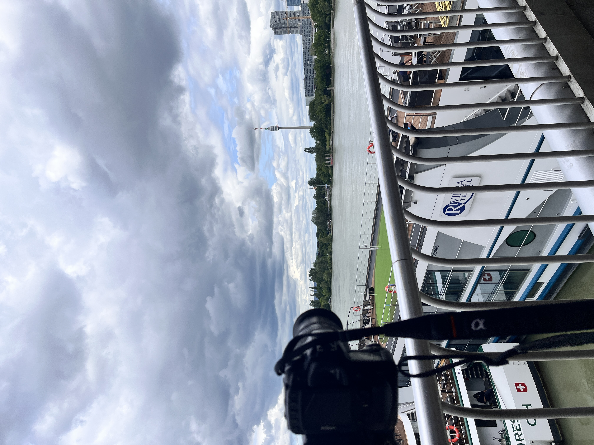

그런데, 도나우 타워보다 훨씬 멋진 건축물이 있었어요.
바로 [St. Francis of Assisi Church](https://www.google.com/maps/place/St.+Francis+of+Assisi+Church/@48.2250205,16.4041129,17.23z/data=!4m6!3m5!1s0x476d071d0cd57cc7:0x43f4679318b21f15!8m2!3d48.2244933!4d16.40535!16s%2Fm%2F0rfhbs6?hl=ko&entry=ttu&g_ep=EgoyMDI1MDkwOC4wIKXMDSoASAFQAw%3D%3D)였어요.
우연히 발견한 이곳은 정말 멋진 건축물이었어요.
날씨도 맑았어서 사진이 정말 잘 찍혔어요!

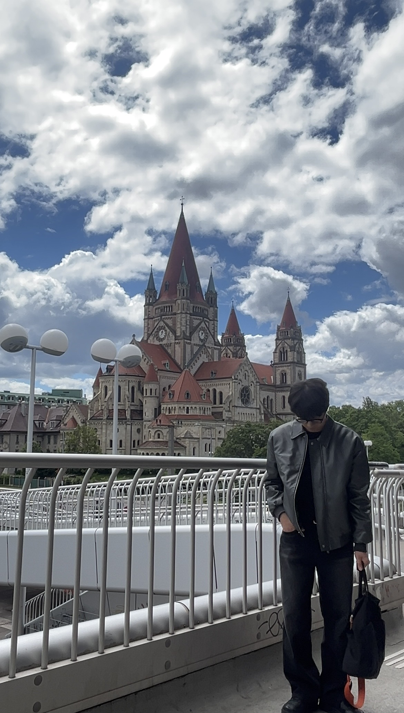

도나우 강을 따라가며 산책하는 것도 좋을 것 같아요.

# 본격적인 영화 따라잡기 - 프라터

포토 스팟 근처에 있는 `프라터`로 이동했습니다.
이곳 프라터는 영화 `비포 선라이즈`의 촬영지로 유명한 곳이에요.
영화에서 주인공 남녀가 이곳의 대관람차에서 키스하는 장면이 유명해요.

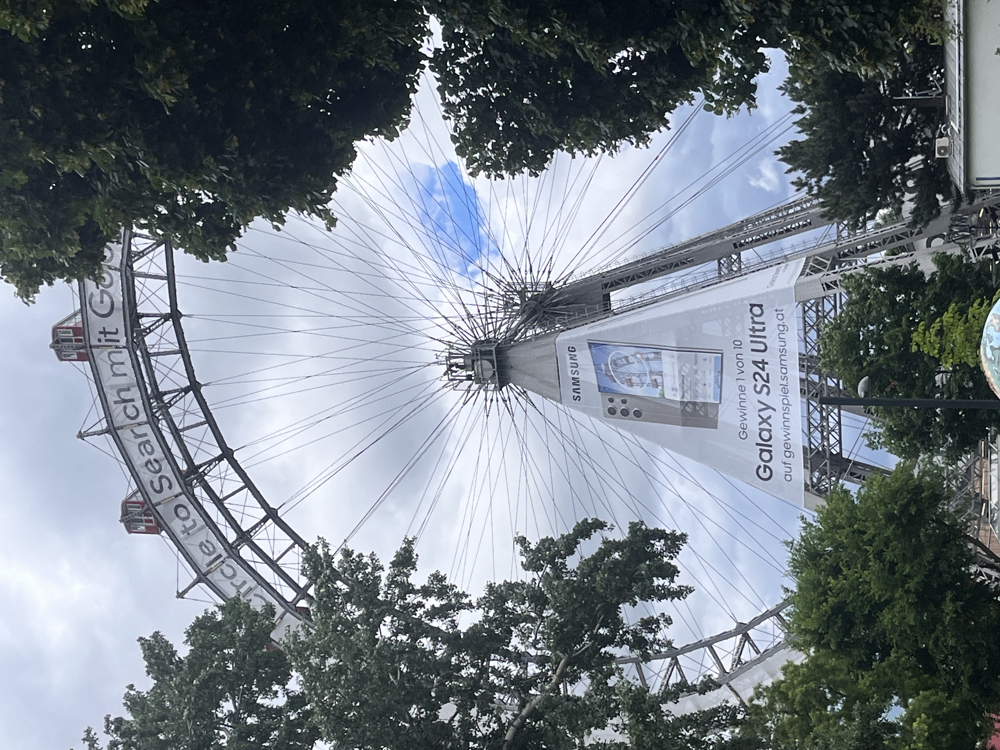

평일이라서 그런지 사람들이 많이 없었어요.
대부분의 놀이기구들이 사람없이 비어있는채로 돌아가기만 했어요.
그래도 사람들이 없어서 구경하기에는 좋았어요.

  

    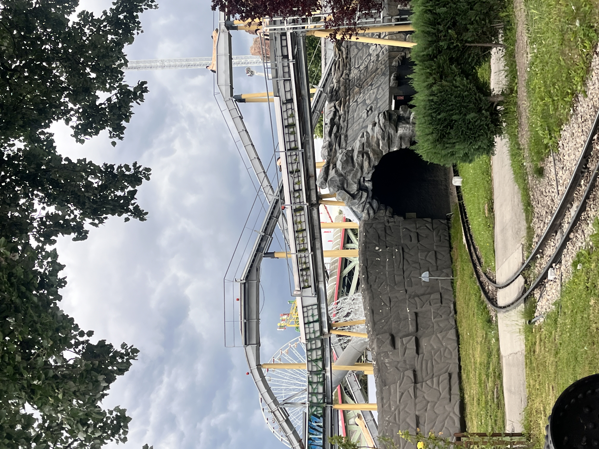
  

  

    <video src="./empty-water-rollercoaster.mp4" type="video/mp4" className="rounded-lg w-full h-auto" controls />
  

# 잊지못할 독일어 점심

프라터가 놀이공원이랑 공원이 갔이 있어 엄청 커서 산책을 하다가 `Praterstern`역에서 점심을 먹었습니다.
역에 컨테이너(?)안에서 파는 슈니첼 버거를 주문했어요.

  

    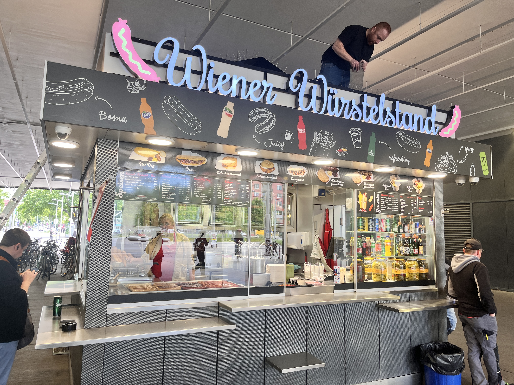
  

  

    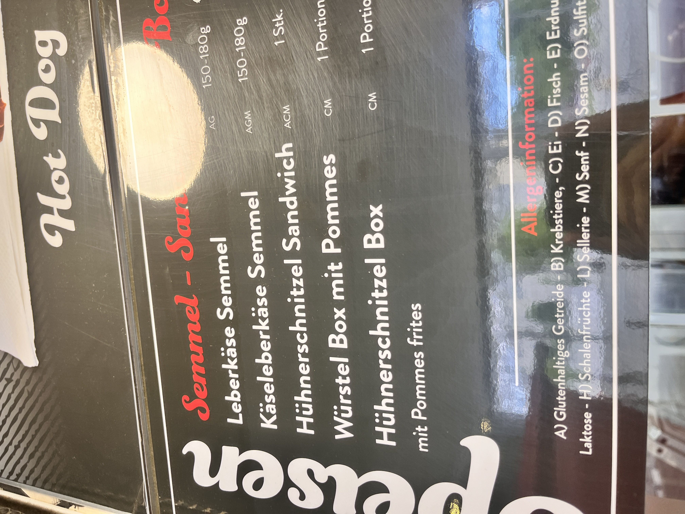
  

그런데, 가게 아주머니가 영어를 못하시고 독일어밖에 못하시더라고요.
지금까지는 영어로 다 해결이 됐는데 이곳은 영어로 주문할 수 없어서 몇분 애를 먹었어요.
결국 창문에 붙어 있는 메뉴판을 사진 찍어서 손가락으로 가리키며 버거 하나와 콜라를 주문했어요.

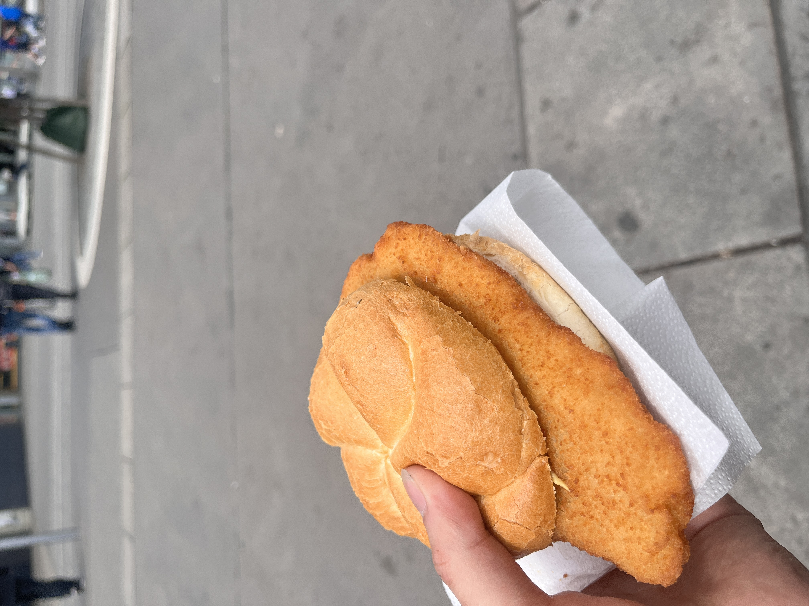

보기에는 안에 재료도 거의 없고 맛도 없을 것 같아 보이지만 의외로 너무 맛있었어요.
공원에 앉아서 먹으니 정말 좋고 힐링되는 시간이었어요.
영어를 못하시는 아주머니와 어찌저찌 주문을 해서 더 기억에 남았어요.

# 자연 친화적 공공 주택
> 훈데르트바서 하우스

오스트라아 출신의 화가이자 건축가 겸 환경 운동가 '훈데르트바서'가 설계한 공공 주택 건물입니다.
나선형과 곡선을 중요시하는 건축가의 철학이 반영된 독특한 외관이 인상적이였어요.
외벽에 각기 다른 색상의 타일을 붙였고, 바닥이 울퉁불퉁하고, 모양이 서로 다른 둥근 기둥이 주변 나무들과 조화를 이루어 자연 친화적인 건물로 평가받고 있다고 합니다.

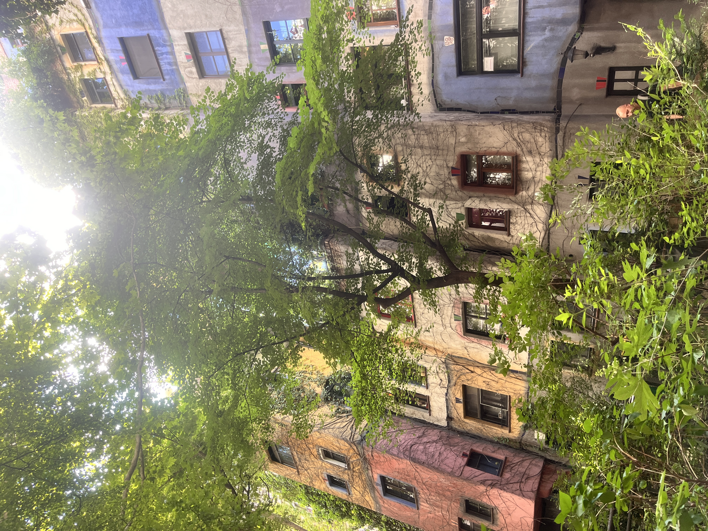

근데 개인적으로 저는 딱히 볼 건 없었어요. 😂

# 본격적인 영화 따라잡기 - 촐암트슈테그 다리
> 영화 `비포 선라이즈`의 촬영지로 유명한 보행자 다리까지

'다뉴브 운하'를 가로지르는 보행자 전용 다리로, 영화 '비포 선라이즈'에서 주인공들이 연극 초대를 받던 장면의 촬영 장소로 사용되었습니다.
다리 밑에 지하철이 지나가서 너무 예뻤어요.

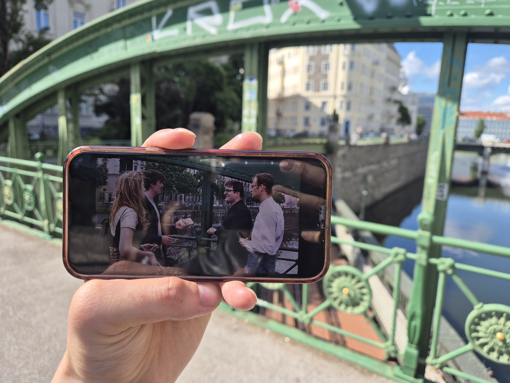

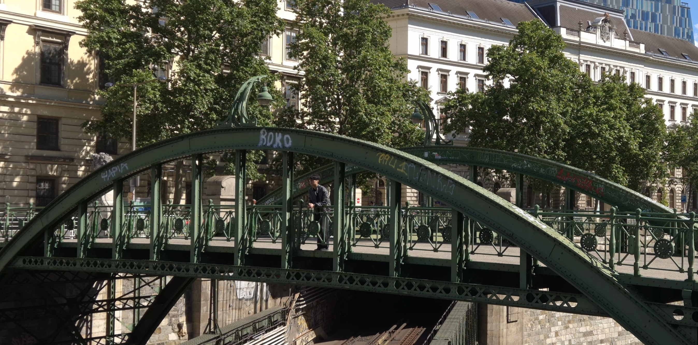

여기서 사진을 찍고 나서 갈려고 하는데 중국인 여성 관광객이 사진을 찍어달라고 하셔서 찍어주니 너도 영화보고 왔냐고 물어보셨어요.
그래서 영화보고 왔다고 하니 자기도 영화를 너무 재밌게 봐서 비엔나에 여행왔다고 하더라고요.
여행을 하다보니 다양한 사람들과 대화를 할 수 있어서 좋았던거 같아요.

# 비엔나에서 제일 유명한 슈니첼 가게
> 피그뮐러

이곳은 비엔나에서 제일 유명한 슈니첼 가게에요.
예약없이는 방문할 수 없어서 한국에서 미리 예약을 했어요.

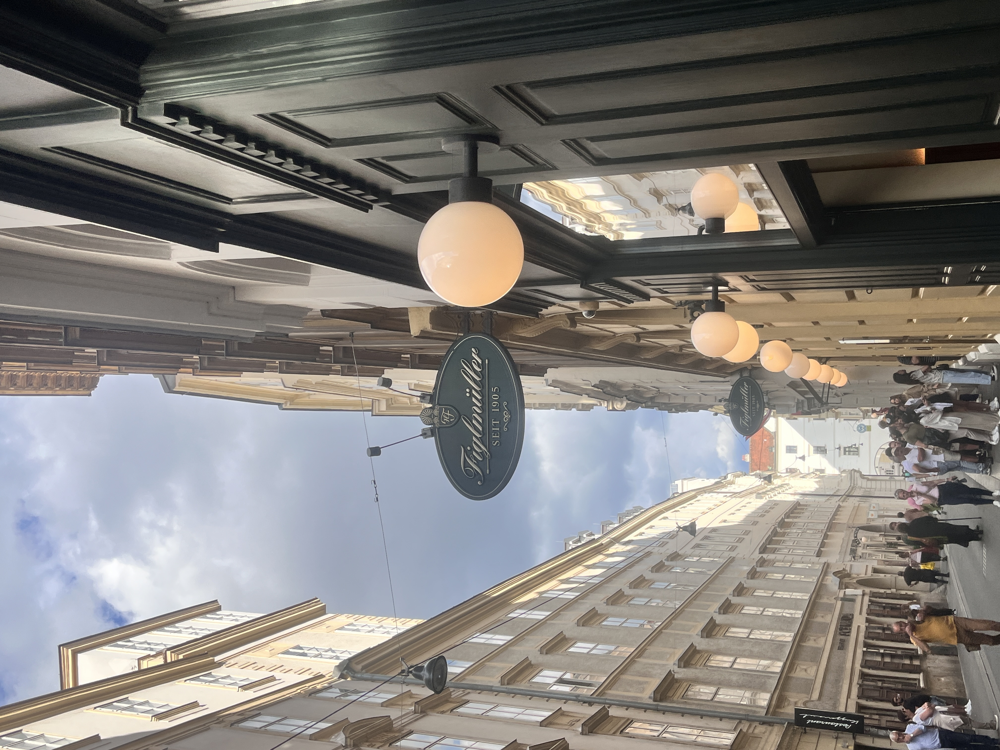

메뉴에는 송아지 슈니첼, 치킨 슈니첼, 돼지 슈니첼이 있었는데, 슈니첼 원조는 송아지여서 저는 송아지 슈니첼을 주문했어요.

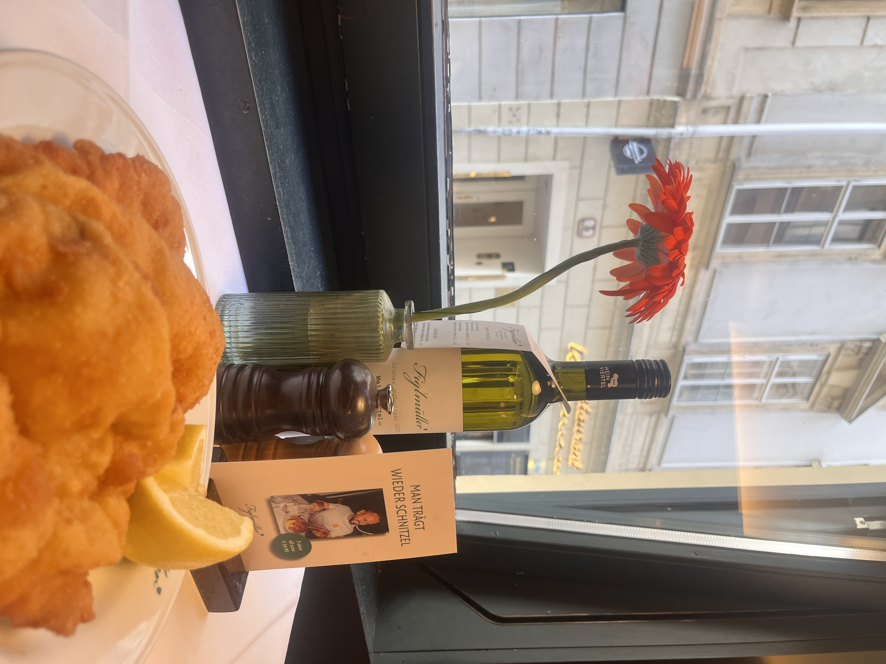

슈니첼은 돈가스같은 메뉴인데, 차이점은 소스가 없고 튀김에 레몬을 짜서 먹는 것이에요.
정말 맛있었어요.
식사를 마치고 비엔나 커피도 시켜서 마셨는데 커피는 한국이랑 큰 차이는 못 느꼈어요.

# 격이 다른 웅장함
> 오페라 하우스

저녁 식사를 마치고 동네를 조금 돌아다니다 보니 금새 해가 저물었어요.
그래서 야경이 예쁜 오페라 하우스로 이동했습니다.

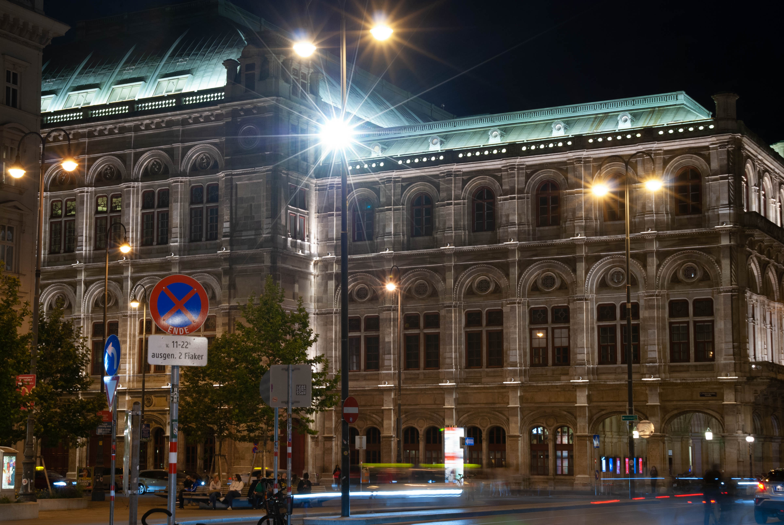

되게 유명한 오페라 하우스 포토 스팟이 있는데, 마침 그 날만 파티가 있었어서 올라갈 수가 없어서 아쉬웠어요.
파티가 다 끝날 때 까지 기다렸다가 올라갔지만, 그때는 오페라 하우스의 불이 다 꺼졌을 때 였습니다.

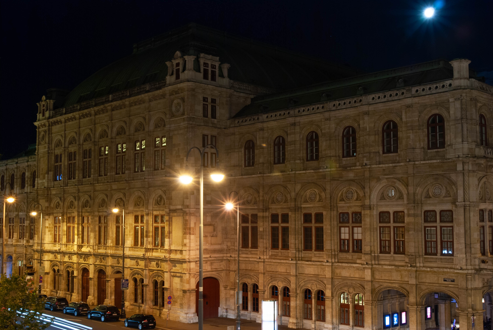

불이 꺼진 것도 나름 괜찮았어요.

<video src="./opera-house-me.mp4" type="video/mp4" className="rounded-lg w-full h-auto" controls />

# 비엔나 3대 카페
> 카페 자허

비엔나에서 3대 카페라고 불리는 카페 중 하나인 카페 자허로 이동했습니다.
낮에 자허를 봤었는데 웨이팅이 엄청 길었었어요.
너무 오래 서있기도 힘들고 혼자 서있기도 힘들어서 그냥 포기했었어요.
그런데 밤에 가니 줄도 없고 안에 자리도 남아 있어서 바로 들어갔어요.
영업 시간도 2시간정도 남아 있을 때였어서 여유있게 커피를 마셨어요.

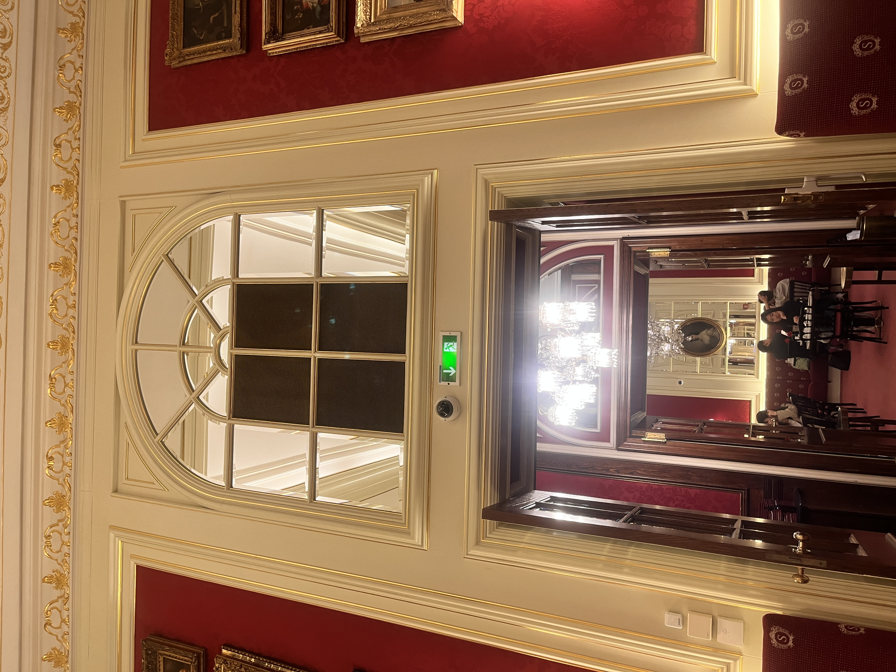

저는 이 카페에 대표 메뉴인 '오리지널 자허토르테'와 '아인슈페너'를 주문했어요.
'오리지널 자허토르테'는 살구잼을 넣은 초콜릿 케이크였어요.

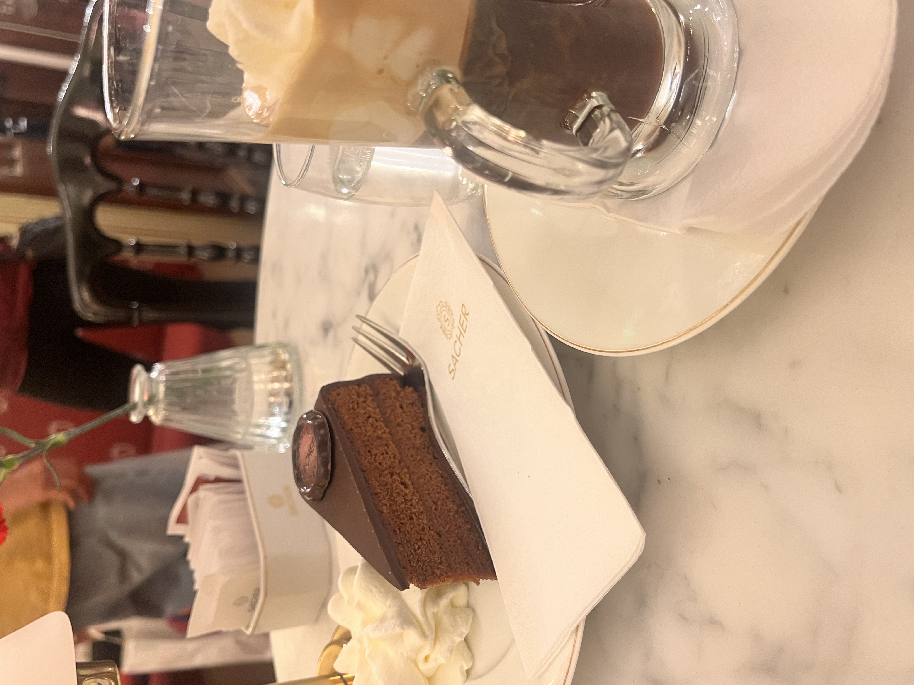

포기하고 있었다가 우연히 들어가서 더 좋았던 것 같아요.

# 마치며

이 날은 비엔나에서의 마지막 날이여서 더 알차고 재미있게 놀려고 했던 것 같아요.
갈 수 있는 곳도 최대한 많이 가고 먹어야 하는 것도 많이 먹고 뭐든 많이 했어요.
이곳 비엔나에서의 너무 좋은 기억들만 가지고 떠나는 것 같아요.

> 다음 포스트는 비엔나에서 부다페스트로 넘어가는 4일차 여행기를 올릴게요!