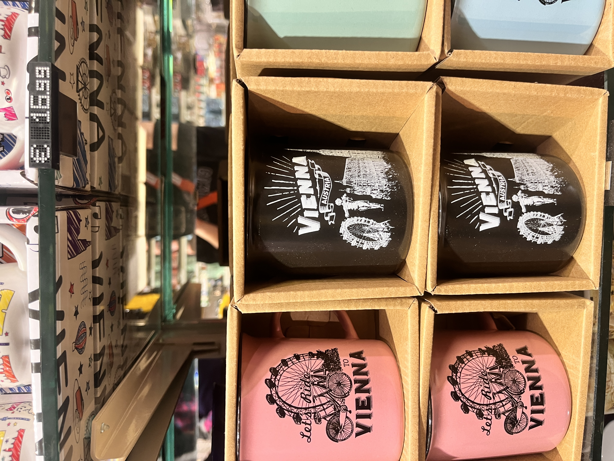
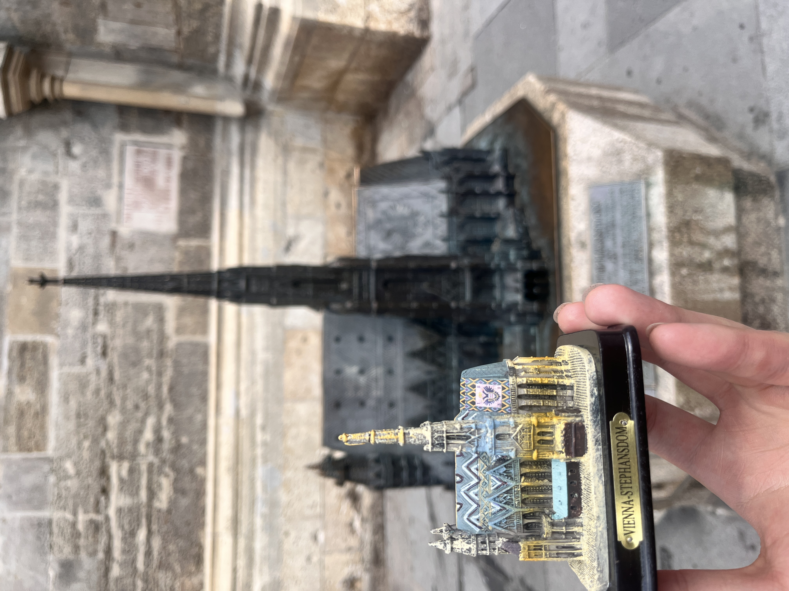
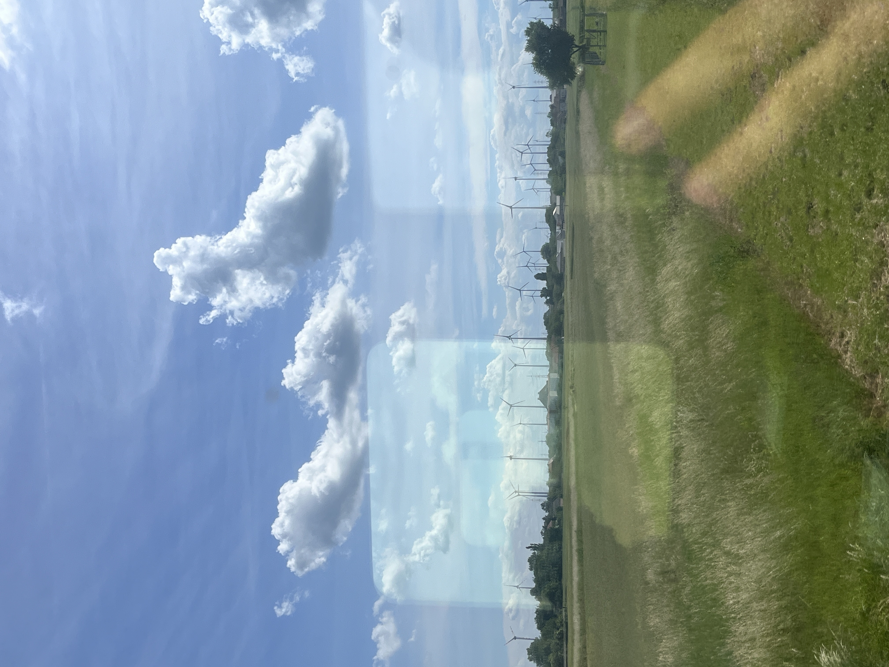
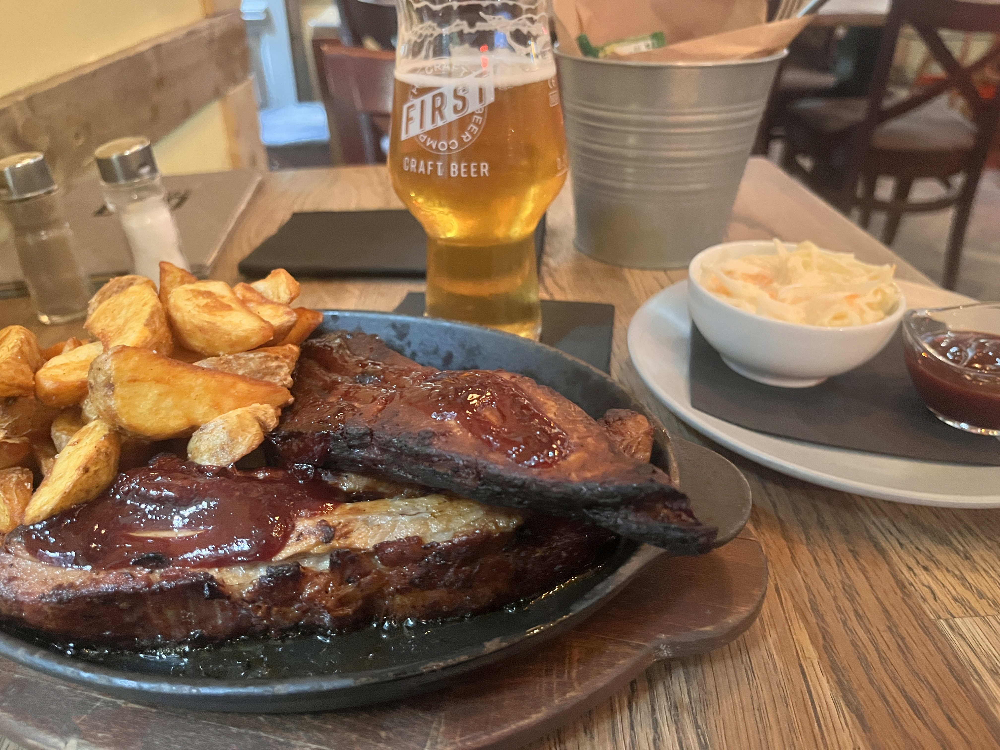

> 2024년 5월 19일부터 5월 27일까지의 동유럽 여행기 \
> 다녀온 여행의 [일정](https://triple.guide/trips/plan/mAQOE108z6Xp2JnLNWpJrGxweD2Y4y)을 공유할게요! \
> 업로드한 사진들은 다 제가 직접 찍은 사진입니다. 😁

# 비엔나를 추억하는 기념품들

이제 비엔나에서 부다페스트로 떠나야 했어요.
떠나기 전 비엔나를 추억하기 위해 기념품 샵에 들러서 몇가지 기념품들을 샀어요.

  

  

비엔나의 랜드마크들이 그려져 있는 컵 3잔과 슈테판 성당 모형을 구매하여 비엔나의 추억을 오래 기억할 수 있게 했어요.

# 부다페스트로 이동

부다페스트로 가기 위해 빈 중앙역으로 이동했어요.
기차를 타고 부다페스트로 이동하는데 밖에 보이는 풍경이 너무 예뻤어요.

유럽의 시골이 너무 평안해보이고 행복해 보였어요.
기차를 예매할 때 좌석을 선택할 수 없어서 랜덤 자리를 배정받았었는데 4인 가족석에 앉게 되었어요.
저 포함해서 3명이 4인석에 앉게 되었는데 알고보니 여자 한 분은 일본인이였고 남자 한 분은 중국인이였어요.
유럽 기차에서 한중일 3명이 우연히 같은 자리에 앉게 된게 너무 신기하고 놀라웠어요.
몇번 대화를 하고 그 뒤로는 말없이 그냥 가게 됐는데 그때 더 말을 걸어볼 걸하는 아쉬움이 남아있어요.

# 인생 맛집을 찾다

어쨋든, 부다페스트에 도착해서 바로 숙소에 가서 짐을 풀고 저녁을 먹으러 밖으로 나왔어요.
숙소가 제일 번화가에 있었어서 식당을 찾기에는 수월했어요.
제가 간 곳은 [First Craft Beer & BBQ](https://www.google.com/maps/place/FIRST+Craft+Beer+%26+BBQ/@47.496562,18.9071567,12z/data=!3m1!5s0x4741dc426902e4b5:0xacd60541090dfdc7!4m10!1m2!2m1!1sthe+first+craft+beer+budapest!3m6!1s0x4741dc4269abecdb:0x6f007951ed851984!8m2!3d47.4965619!4d19.0595916!15sCh10aGUgZmlyc3QgY3JhZnQgYmVlciBidWRhcGVzdCIDiAEBWh8iHXRoZSBmaXJzdCBjcmFmdCBiZWVyIGJ1ZGFwZXN0kgEKcmVzdGF1cmFudJoBI0NoWkRTVWhOTUc5blMwVkpRMEZuU1VOdE5sbHRURmxuRUFFqgF5Cg0vZy8xMWRfdDN4cHR6Cg0vZy8xMWg4ZHZ4azF4EAEqFCIQZmlyc3QgY3JhZnQgYmVlcigAMh4QASIa7tIvfwTTCbuU1Nnc-fFOp0e6pMsPi8Z3xp4yIRACIh10aGUgZmlyc3QgY3JhZnQgYmVlciBidWRhcGVzdOABAPoBBQj7ARBE!16s%2Fg%2F11gdbp448r?entry=ttu&g_ep=EgoyMDI1MDkxMC4wIKXMDSoASAFQAw%3D%3D)였어요.
여기는 Spare Ribs와 수제 맥주를 파는 곳이였어요.

여기 진짜 너무 맛있어요! 진짜 진짜 완전 강추!
맥주와 립의 조화가 너무 좋았어요.
가격도 많이 비싼 편도 아니고 너무 맛있게 먹었어요.

# 세상에서 가장 아름다운 맥도날드

부다페스트에 세상에서 가장 아름다운 맥도날드가 있다는 블로그를 봤었어요.  